# Red Social

## Descripción de la aplicación  

* Esta aplicación consiste en una API funcional de Express.js que funciona como back end para un sitio web de red social.
* Asimismo, esta aplicación emplea una base de datos NoSQL, usando MongoDB y el ODM Mongoose.
* La aplicación incluye:
    * Rutas GET para traer todos los usuarios y todos los pensamientos.
    * Rutas GET para traer un solo usuario y un solo pensamiento.
    * Rutas POST, PUT y DELETE para crear, actualizar y eliminar usuarios.
        * Cabe mencionar que cuando se elimina un usuario, se eliminan los pensamientos asociados a dicho usuario.
    * Rutas POST, PUT y DELETE para crear, actualizar y eliminar pensamientos.
    * Rutas POST y DELETE para agregar y eliminar amigos a la lista de amigos de un usuario.
    * Rutas POST y DELETE para crear y eliminar reacciones a pensamientos.
    
## Estructura de la base de datos

 * La base de datos tiene el nombre de "RedSocialDB" y está conformada por 2 colecciones llamadas "thoughts" y "users".
 * En total, se emplean 3 esquemas de base de datos: "userSchema", "thoughtSchema" y "reactionSchema". 
 * A partir de los dos primeros esquemas, se crean los modelos "User" y "Thought", respectivamente, mientras que el "reactionSchema" se mantiene como esquema de subdocumento del campo "reaction" en el esquema "thoughtSchema".
 * En la siguiente imagen se puede observar la configuración de los esquemas.  
    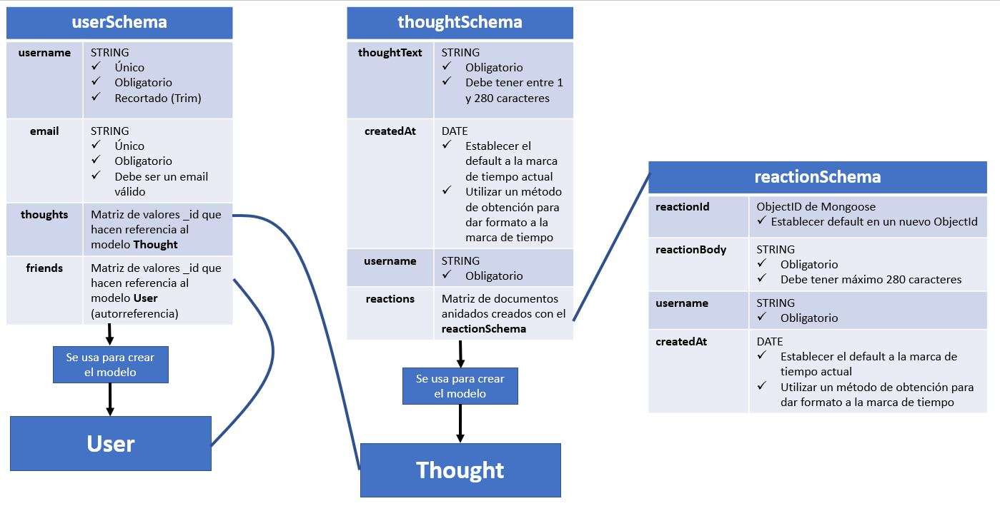  
 * Al ejecutar el comando "npm run seed" desde la terminal de node.js (estando en la carpeta principal/raíz), se pueden crear algunos documentos iniciales en las colecciones de la base de datos.  
    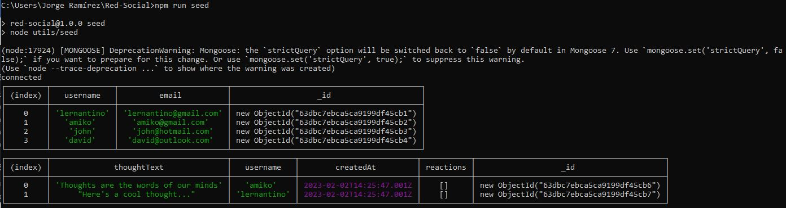

## Instrucciones de instalación  

* Esta aplicación requiere de:
    * Instalación de node JS versión 16.18.0
    * Instalación del paquete express 4.17.1
    * Instalación del paquete dayjs 1.11.7
    * Instalación del paquete mongoose 6.0.13

## Instrucciones para realizar pruebas 

* La ejecución de la aplicación se tiene que hacer desde la terminal de node.js
* Asegúrate de estar en la ubicación de la carpeta principal/raíz de la aplicación: RED-SOCIAL\      
  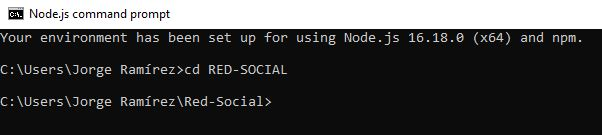
* Para crear algunos documentos iniciales en las colecciones de la base de datos, puedes ejecutar el comando "npm run seed"  
  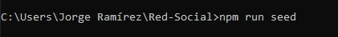
* Para iniciar el servidor y poder utilizar las rutas, emplea el comando "npm start" desde la terminal de node.js    
  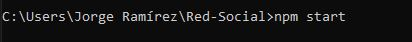
* A partir de este punto puedes emplear la dirección http://localhost:3001/ para probar las diferentes rutas y hacer las respectivas consultas a la base de datos. Para ello puedes utilizar algún programa como Insomnia.    
  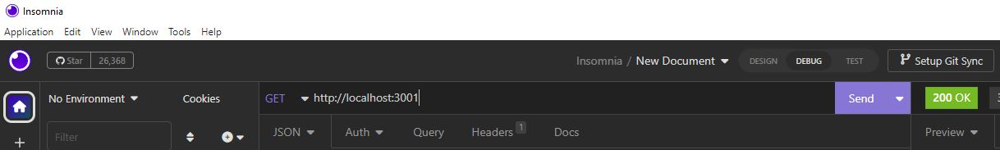

## Información de uso de la aplicación

* Una vez que hayas iniciado el servidor mediante el comando "npm start" desde la terminal de node.js y utilizando algún programa/plataforma como Insomnia:

### Rutas para User

* Para traer/mostrar todos los usuarios contenidos en la base de datos utiliza la siguiente ruta GET:  
    **`http://localhost:3001/api/users`**  
    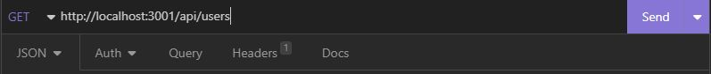    
    * Si la consulta es exitosa, verás una respuesta similar a esta:    
    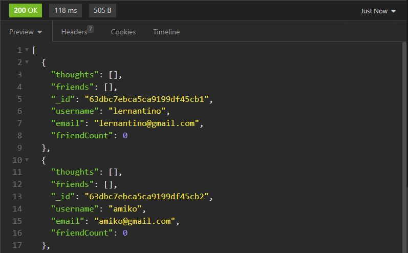  
* Para traer un solo usuario contenido en la base de datos utiliza la siguiente ruta GET, sustituyendo ":userId" con el "id" del usuario que deseas traer:    
    **`http://localhost:3001/api/users/:userId`**    
    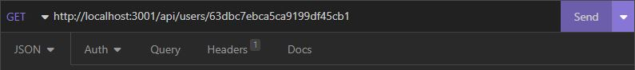      
    * Si la consulta es exitosa, verás una respuesta similar a esta:    
      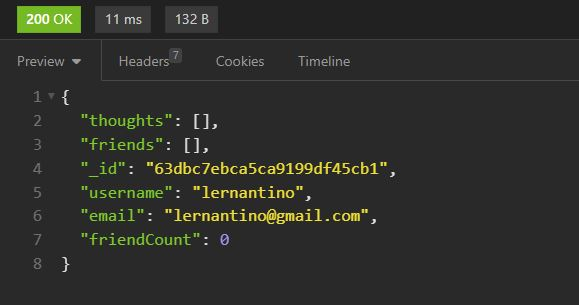  
* Para crear un usuario en la base de datos, utiliza la siguiente ruta POST y construye el cuerpo de la solicitud en formato JSON con el nombre de usuario y su correo electrónico:  
    **`http://localhost:3001/api/users`**  
    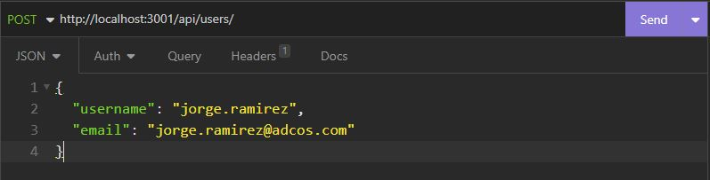  
    * Si la creación es exitosa, verás una respuesta similar a esta:  
      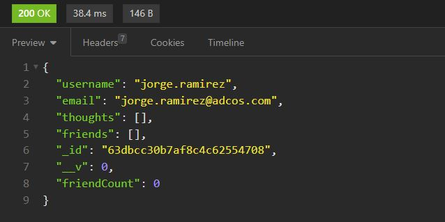  
* Para actualizar un usuario en la base de datos, utiliza la siguiente ruta PUT, sustituyendo ":userId" con el "id" del usuario que deseas actualizar y construye el cuerpo de la solicitud en formato JSON con el nuevo nombre de usuario y/o el nuevo correo electrónico:  
    **`http://localhost:3001/api/users/:userId`**   
    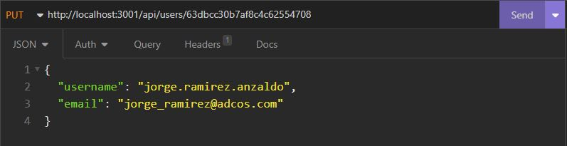  
    * Si la actualización es exitosa, verás una respuesta similar a esta:   
     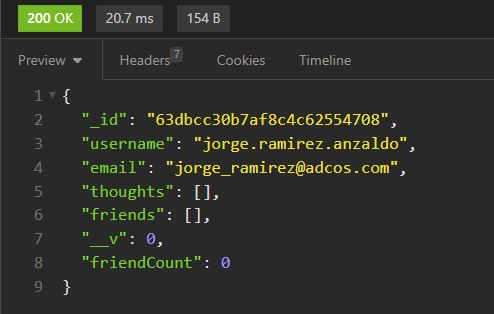 
* Para eliminar una usuario de la base de datos, utiliza la siguiente ruta DELETE, sustituyendo ":userId" con el "id" del usuario que deseas eliminar: 
    **`http://localhost:3001/api/users/:userId`**  
    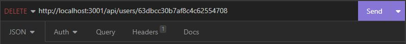  
    * Si la eliminación es exitosa, verás una respuesta similar a esta:     
      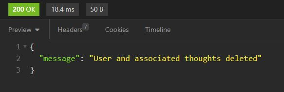 
* Para agregar un amigo a la lista de amigos de un usuario:  
    * Utiliza la siguiente ruta POST: **`http://localhost:3001/api/users/:userId/friends/:friendId`**  
    * Sustituye el ":userId" con el "id" del usuario al cual se le agregará un amigo.  
    * Sustituye el ":friendId" con el "id" del usuario que será el nuevo amigo en la lista de amigos.  
    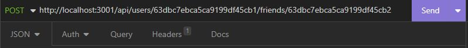  
    * Si la creación es exitosa, verás una respuesta similar a esta:    
      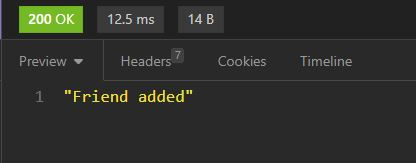  
* Para eliminar un amigo de la lista de amigos de un usuario:  
    * Utiliza la siguiente ruta DELETE: **`http://localhost:3001/api/users/:userId/friends/:friendId`**  
    * Sustituye el ":userId" con el "id" del usuario al cual se le quitará un amigo específico.  
    * Sustituye el ":friendId" con el "id" del usuario que será removido de la lista de amigos.  
    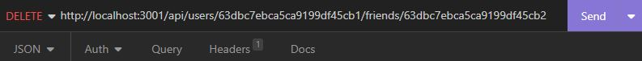  
    * Si la eliminación es exitosa, verás una respuesta similar a esta:   
      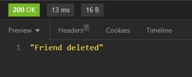  

### Rutas para Thought

* Para traer/mostrar todos los pensamientos contenidos en la base de datos utiliza la siguiente ruta GET:    
    **`http://localhost:3001/api/thoughts`**  
    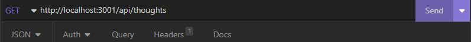  
    * Si la consulta es exitosa, verás una respuesta similar a esta:  
      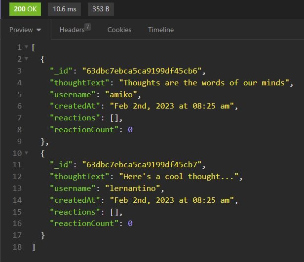 
* Para traer un solo pensamiento contenido en la base de datos utiliza la siguiente ruta GET, sustituyendo ":thoughtId" con el "id" del pensamiento que deseas traer:      
    **`http://localhost:3001/api/thoughts/:thoughtId`**    
    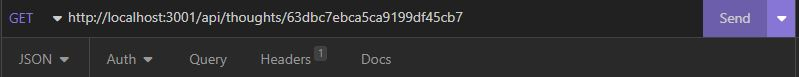      
    * Si la consulta es exitosa, verás una respuesta similar a esta:    
      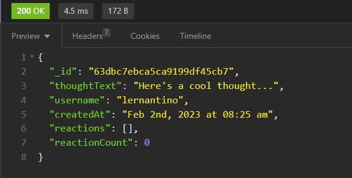 
* Para crear un pensamiento en la base de datos, utiliza la siguiente ruta POST y construye el cuerpo de la solicitud en formato JSON con el texto del pensamiento, el nombre de usuario y el id del usuario que lo crea:  
    **`http://localhost:3001/api/thoughts`**  
    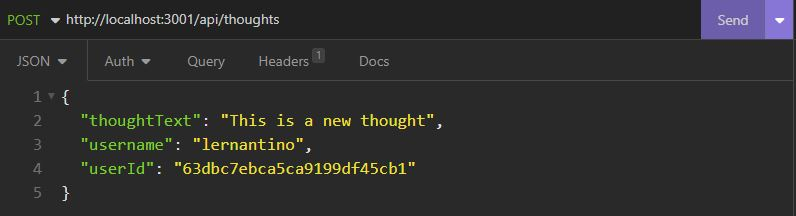  
    * Si la creación es exitosa, verás una respuesta similar a esta:   
      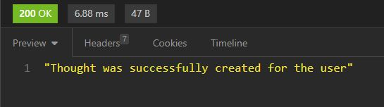  
* Para actualizar un pensamiento en la base de datos, utiliza la siguiente ruta PUT, sustituyendo ":thoughtId" con el "id" del pensamiento que deseas actualizar y construye el cuerpo de la solicitud en formato JSON con el nuevo texto del pensamiento:  
    **`http://localhost:3001/api/thoughts/:thoughtId`**   
    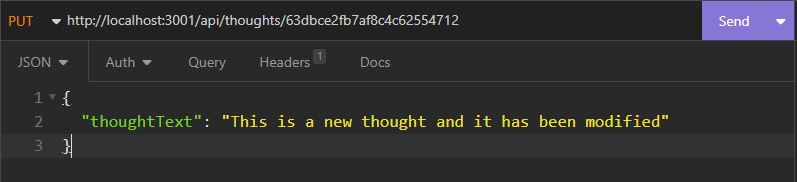    
    * Si la actualización es exitosa, verás una respuesta similar a esta:   
     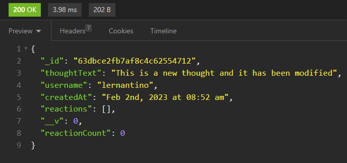  
* Para eliminar un pensamiento de la base de datos, utiliza la siguiente ruta DELETE, sustituyendo ":thoughtId" con el "id" del pensamiento que deseas eliminar: 
    **`http://localhost:3001/api/thoughts/:thoughtId`**  
    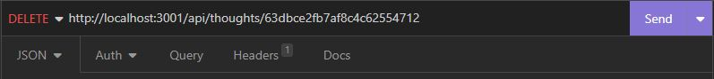  
    * Si la eliminación es exitosa, verás una respuesta similar a esta:     
      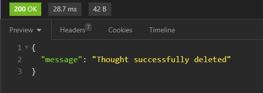  
* Para agregar una reacción a un pensamiento, utiliza la siguiente ruta POST, sustituyendo ":thoughtId" con el "id" del pensamiento al cual se le agregará la reacción y construye el cuerpo de la solicitud en formato JSON con el texto de la reacción y el nombre del usuario que la creó:  
    **`http://localhost:3001/api/thoughts/:thoughtId/reactions`**  
    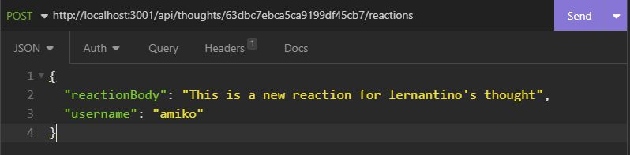  
    * Si la creación es exitosa, verás una respuesta similar a esta:    
      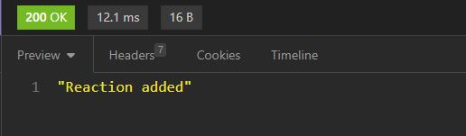  
* Para eliminar una reacción de un pensamiento específico:  
    * Utiliza la siguiente ruta DELETE: **`http://localhost:3001/api/thoughts/:thoughtId/reactions/:reactionId`**    
    * Sustituye el ":thoughtId" con el "id" del pensamiento al cual se le quitará una reacción específica.  
    * Sustituye el ":reactionId" con el "reactionId" de la reacción que será removida del pensamiento.  
    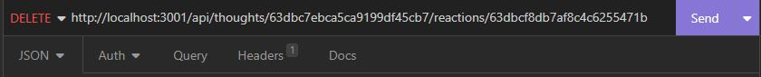  
    * Si la eliminación es exitosa, verás una respuesta similar a esta:   
      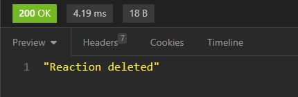 

## Enlace a video de funcionalidad de la aplicación

* [Link a video de aplicación](https://drive.google.com/file/d/1ulwMeq94_J-SUGH560khD_6simztD0D7/view)

